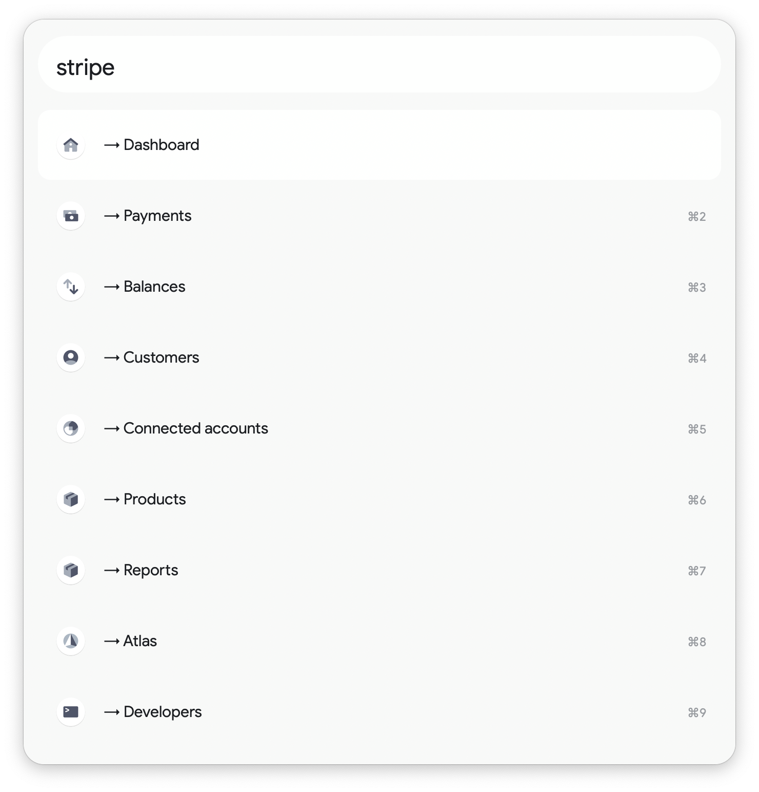
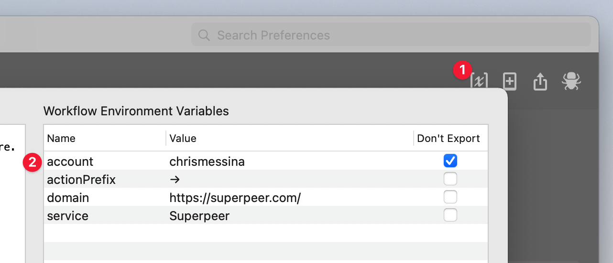

# Alfred Toolkit for Stripe

The Superpeer Toolkit for Alfred makes it easy to quickly access Superpeer's web features, including calls, discount codes, and more, using the `superpeer` keyword.

You will need to have a Superpeer account to benefit from this workflow, since nearly all shortcuts require authentication.

This workflow doesn't support programmatic access to Superpeer.

# Installation

1. Download the [latest release here](https://github.com/chrismessina/alfred-superpeer-toolkit/releases/latest).
2. Double-click the `.alfredworkflow` to install it.

_You will need to purchase the [Alfred Powerpack](https://www.alfredapp.com/powerpack/) to enable this workflow._

# Configuration

Once the workflow is installed, launch **Alfred Preferences**, choose **Workflows** and then select **Superpeer Toolkit**.

➊ Access the **Workflow Environment Variables** in the top right of the window:

## Set your username

This workflow makes it easy to access your own Superpeer profile.

➋ To configure this feature, you must set the `account` variable in the configuration to *your own username*.

# Changelog[¹](https://keepachangelog.com/)

## [v0.1.0] - 2021-01-10
- Initial Release

# About

This workflow is unaffiliated with nor endorsed by Superpeer, Inc.

You can [file bugs](https://github.com/chrismessina/alfred-superpeer-toolkit/issues/new) or [submit feature requests](https://github.com/chrismessina/alfred-superpeer-toolkit/issues/new) on GitHub using the label `workflow:superpeer-toolkit`.
